<div align="center">


### 실시간 경매형 중고거래 플랫폼

**흥정 없는 공정한 거래**

[](https://up-pick.com)
[](https://up-pick.github.io/up-pick-main/)

</div>

---

## 📋 목차

- [서비스 개요](#-서비스-개요)
- [핵심 기능](#-핵심-기능)
- [아키텍처](#-아키텍처)
- [설계 문서](#-설계-문서)
- [기술 스택](#-기술-스택)
- [성능 개선](#-성능-개선)
- [기술적 의사결정](#-기술적-의사결정)
- [트러블 슈팅](#-트러블-슈팅)
- [팀원 소개](#-팀원-소개)

---

## 👀 서비스 개요

**UPPICK** — 실시간 경매형 거래 플랫폼

> 누구나 쉽고, 공정하게, 재미있게 거래할 수 있도록

- ⚡ 원하는 상품에 **실시간으로 입찰**
- 📊 **입찰 내역과 현재가가 반영**되어 투명한 경쟁
- 🏆 **경매 종료 시 자동 낙찰**, 복잡한 흥정은 NO
- 💳 **크레딧(포인트)** 기반으로 안전하게 거래

**흥정 없는 중고 거래, 실시간으로 즐기는 스마트한 쇼핑**

> 오늘 당신의 쇼핑을 "UP"하게, **UPPICK** 🚀

---

## 🗝️ 핵심 기능

### 💰 실시간 경매 입찰 시스템

| 핵심 기술      | 설명                       |
|------------|--------------------------|
| **동시성 제어** | Redis 분산 락으로 안전한 입찰 처리   |
| **입찰 검증**  | 현재 최고 입찰가보다 높은 금액만 허용    |
| **크레딧 관리** | 입찰 성공 시 차감, 이전 입찰자 자동 환불 |
| **자동 마감**  | 경매 종료 시 낙찰/유찰 자동 판정      |

### 🔔 알림 시스템

| 핵심 기술      | 설명                     |
|------------|------------------------|
| **비동기 처리** | RabbitMQ 이벤트 기반 메시지 큐  |
| **실시간 알림** | 입찰 성공/실패, 경매 종료, 낙찰 알림 |

### 🔍 상품 검색 및 필터링

| 핵심 기술       | 설명                           |
|-------------|------------------------------|
| **검색 엔진**   | AWS OpenSearch 기반 실시간 전문 검색  |
| **실시간 동기화** | Redis → OpenSearch 입찰가 자동 반영 |
| **고급 필터링**  | 카테고리, 가격대, 상태 등 다중 조건 검색     |
| **검색 분석**   | 키워드 자동 수집 및 랭킹 집계            |

### 🖼️ 상품 이미지 관리

| 핵심 기술         | 설명                                  |
|---------------|-------------------------------------|
| **클라우드 스토리지** | AWS S3 직접 업로드                       |
| **지원 형식**     | JPG, JPEG, PNG, GIF, WebP (최대 10MB) |
| **환경별 분리**    | dev/prod: S3, local: 로컬 저장          |

### ⚙️ 배치 처리 시스템

| 구분        | Spring Batch (초기)     | AWS Lambda (현재)           |
|-----------|-----------------------|---------------------------|
| **아키텍처**  | EC2 기반 스케줄 배치         | EventBridge + Lambda 서버리스 |
| **비용 모델** | 24시간 고정 비용            | 실행 시간만큼만 과금               |
| **확장성**   | 수동 스케일링               | 자동 스케일 아웃                 |
| **성능**    | Chunk 최적화 (20~25% 개선) | 즉각적인 처리                   |
| **운영**    | 서버 관리 필요              | 서버리스 (관리 불필요)             |

---

## 🖇️ 아키텍처

<details open>
<summary><b>🏗️ 전체 시스템 아키텍처</b></summary>

<br/>

<p align="center">
  
</p>

</details>

### MSA 구조

```
┌─────────────────────────────────────────────────┐
│              API Gateway (8080)                 │
│         Spring Cloud Gateway + JWT              │
└────────────────┬────────────────────────────────┘
                 │
     ┌───────────┼───────────┐
     │           │           │
┌────▼────┐ ┌───▼─────┐ ┌───▼────────┐
│  Main   │ │ Auction │ │   Lambda   │
│ Service │ │ Service │ │  Functions │
│  (8081) │ │  (8082) │ │   (AWS)    │
└────┬────┘ └────┬────┘ └─────┬──────┘
     │           │            │
     └───────────┴────────────┘
                 │
    ┌────────────┼────────────┬──────────┐
    │            │            │          │
┌───▼───┐   ┌───▼────┐  ┌───▼────┐ ┌──▼─────┐
│ MySQL │   │ Redis  │  │ Rabbit │ │ Open   │
│Master │   │ Cache  │  │   MQ   │ │ Search │
│Slave  │   │        │  │        │ │        │
└───────┘   └────────┘  └────────┘ └────────┘
```

### 서비스별 역할

| 서비스                  | 포트   | 역할                     | 주요 기술                        |
|----------------------|------|------------------------|------------------------------|
| **API Gateway**      | 8080 | 라우팅, 인증 필터, 로드 밸런싱     | Spring Cloud Gateway         |
| **Main Service**     | 8081 | 회원, 인증, 알림, 랭킹, 검색     | Spring Boot, JPA             |
| **Auction Service**  | 8082 | 경매, 상품, 입찰 처리          | Spring Boot, Redis, RabbitMQ |
| **Lambda Functions** | -    | 서버리스 배치 (입찰가, 조회수, 랭킹) | AWS Lambda, Java 21          |

---

## 📘 설계 문서

### 🔗 ERD

<details>
<summary><b>📊 데이터베이스 설계 보기</b></summary>

<br/>

<p align="center">
  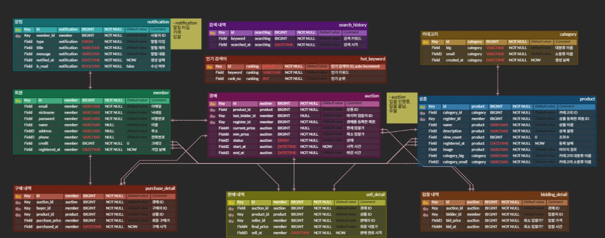
</p>

</details>

### 🌐 API 명세서

📄 [API 명세서 LINK](https://up-pick.github.io/up-pick-main/)

### 🏫 와이어프레임

<details>
<summary><b>📱 화면 설계 보기</b></summary>

<br/>

<p align="center">
  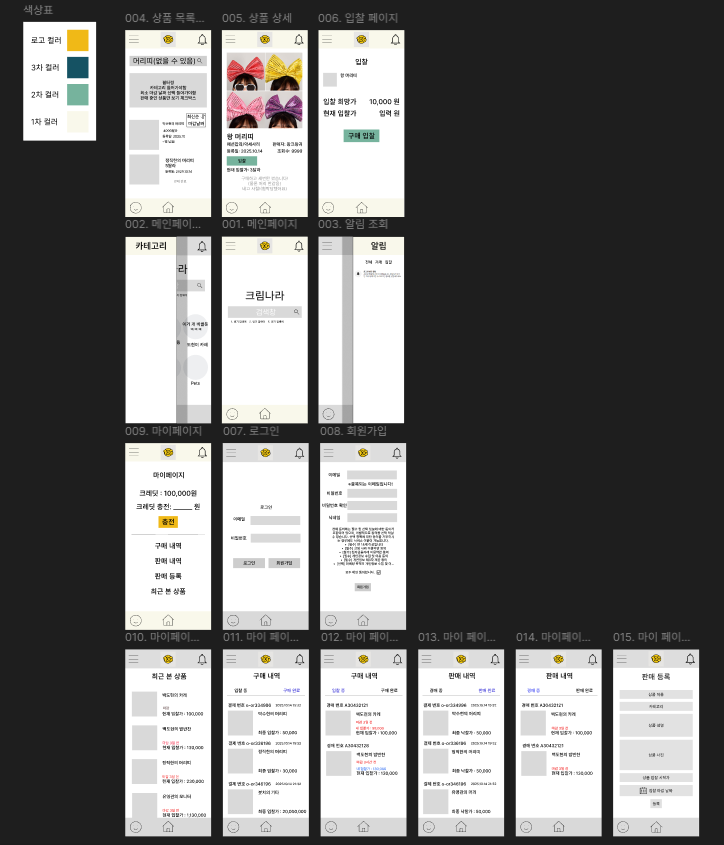
</p>

</details>

---

## 🛠️ 기술 스택

### 🖥️ Language


### 🧑🏻‍💻 Framework & Library


### 💾 Database


### 🔗 Middleware


### 🔐 Security


### 🌐 AWS Infrastructure


### 📈 Monitoring


### 🔨 CI/CD


### 🛠 Test


### 🧩 Test Tools


### 📲 IDE


### 👥 Community


### 🎨 Design


---

## ⚡ 성능 개선

<details>
<summary><b>1️⃣ Redis 캐싱 적용 후 DB CPU 부하 비교</b></summary>

| 항목             | 캐싱 전          | 캐싱 후             |
|----------------|---------------|------------------|
| **평균 CPU 사용률** | 3~6%          | 0.3~0.8%         |
| **최대 CPU 사용률** | 7%            | ~1%              |
| **DB 조회 빈도**   | 모든 요청마다 DB 접근 | Redis 캐시로 대부분 처리 |

**개선율**: CPU 사용률 **약 80~90% 감소**

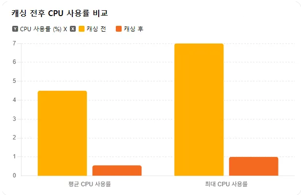

</details>


<details>
<summary><b>2️⃣ 메시지 큐 도입 전후 비교</b></summary>

| 항목           | 적용 전       | 적용 후        | 개선율         |
|--------------|------------|-------------|-------------|
| **평균 응답시간**  | 240ms      | 153ms       | 🔽 약 36% 감소 |
| **처리 방식**    | 동기 처리      | 비동기 처리      | -           |
| **클라이언트 응답** | 모든 로직 완료 후 | 핵심 로직 완료 즉시 | -           |

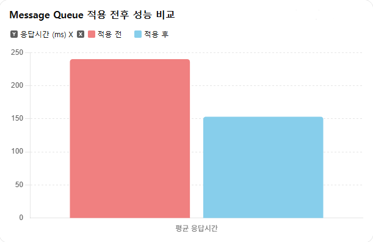

</details>

<details>
<summary><b>3️⃣ 조회수 증가 로직: 낙관적 락 vs Redis</b></summary>

| 항목               | 낙관적 락  | Redis 기반 처리       |
|------------------|--------|-------------------|
| **테스트 실행 시간**    | 2.474초 | **1.014초**        |
| **성공 횟수**        | 1,467  | **5,000**         |
| **실패 횟수**        | 3,533  | **0**             |
| **최종 상품 조회수 반영** | 1,467  | **5,000 (정상 반영)** |

**개선율**: 처리 시간 **59% 단축**, 성공률 **100% 달성**

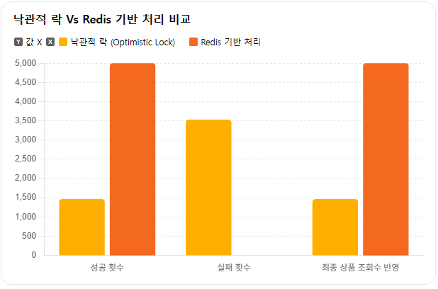

</details>


<details>
<summary><b>4️⃣ 복합 키 인덱스 적용 전후 비교</b></summary>

| 항목        | 인덱스 적용 전        | 인덱스 적용 후         | 개선율                    |
|-----------|-----------------|------------------|------------------------|
| **최솟값**   | 294ms           | 38ms             | 약 87% 감소               |
| **최댓값**   | 508ms           | 182ms            | 약 64% 감소               |
| **평균**    | 417.6ms         | 124.0ms          | **약 70% 감소 (3.3배 향상)** |
| **실행 계획** | Full Table Scan | Index Range Scan | -                      |

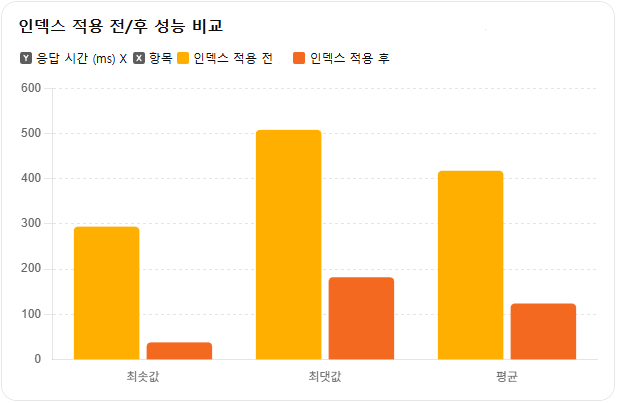

</details>


<details>
<summary><b>5️⃣ MySQL 기본 테이블 vs MySQL Full-Text Search vs Elasticsearch</b></summary>

| 방식                              | 평균 응답 시간 | 부분 검색 지원 | 개선율                   |
|---------------------------------|----------|----------|-----------------------|
| **기본 MySQL (LIKE 검색)**          | 690ms    | 부정확      | -                     |
| **Full-Text Search (N-gram=2)** | 302ms    | 지원       | 약 56% 감소 (2.3배 향상)    |
| **Elasticsearch**               | 52ms     | 지원       | **약 92% 감소 (13배 향상)** |

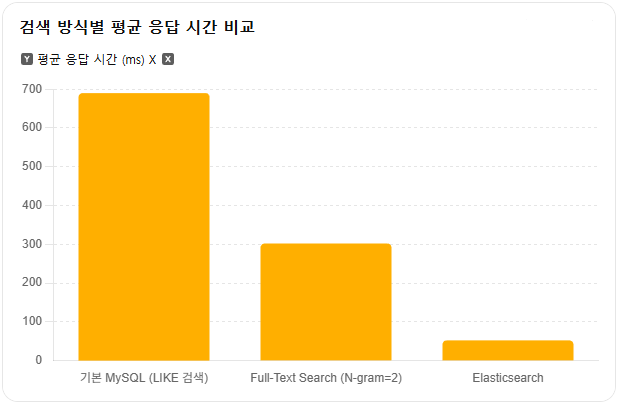

</details>


<details>
<summary><b>6️⃣ 버추얼 스레드 적용 전후 성능 비교</b></summary>

| 항목           | 적용 전    | 적용 후     | 변화               |
|--------------|---------|----------|------------------|
| **평균 TPS**   | 146.6   | 395.0    | 약 **2.7배 증가**    |
| **총 요청 수**   | 46,515건 | 118,913건 | 약 **+156% 증가**   |
| **에러율**      | 1.07%   | 0.00%    | **완전 안정화**       |
| **평균 응답시간**  | 1,760ms | 9.9ms    | **99.4% 개선**     |
| **P95 응답시간** | 19.6초   | 17.2ms   | **1,000배 이상 개선** |

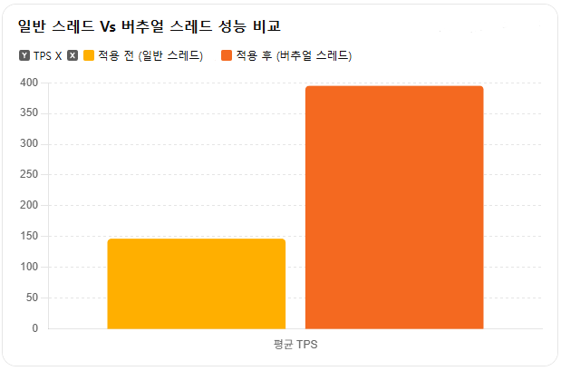

</details>

<details>
<summary><b>7️⃣ Replica 적용 전후 비교</b></summary>

| 항목           | 적용 전             | 적용 후                              |
|--------------|------------------|-----------------------------------|
| **MySQL 구성** | 단일 인스턴스          | Master + Slave 구성                 |
| **CPU 부하**   | Master 약 800% 급등 | Master 30%, Slave 700% (읽기 부하 분산) |
| **메모리 사용량**  | 450MB/512MB      | Master 413MB / Slave 429MB        |
| **평균 TPS**   | 155.96           | 165.35 (**+6% 향상**)               |

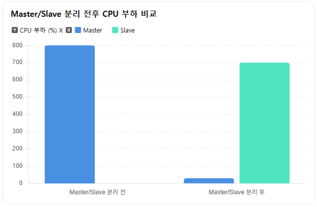

</details>

<details>
<summary><b>8️⃣ 배치 성능 테스트</b></summary>

#### ViewCount Batch

| 데이터 건수  | 처리 시간  | 목표 시간 | 결과   | 처리량 (TPS)       |
|---------|--------|-------|------|-----------------|
| 100건    | 0.036초 | < 1초  | ✅ 통과 | ~2,778 TPS      |
| 1,000건  | 0.106초 | < 5초  | ✅ 통과 | ~9,434 TPS      |
| 10,000건 | 0.773초 | < 30초 | ✅ 통과 | **~12,937 TPS** |

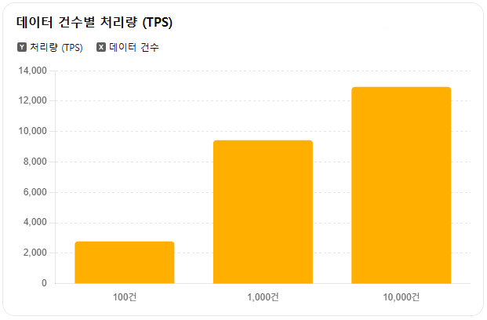

#### BidPrice Batch

| 데이터 건수  | 처리 시간  | 목표 시간 | 결과   | 처리량 (TPS)       |
|---------|--------|-------|------|-----------------|
| 100건    | 0.368초 | < 1초  | ✅ 통과 | ~272 TPS        |
| 1,000건  | 0.105초 | < 5초  | ✅ 통과 | ~9,524 TPS      |
| 10,000건 | 0.948초 | < 30초 | ✅ 통과 | **~10,549 TPS** |

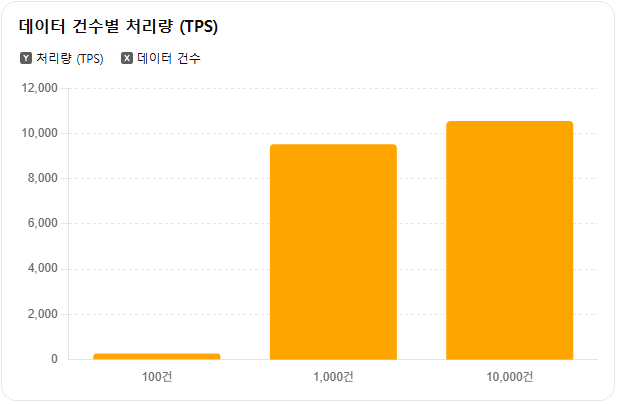

#### Ranking Batch

| 테스트 케이스        | 실행 시간       | 목표 시간   | 결과    |
|----------------|-------------|---------|-------|
| 정상 API 호출      | 0.006초      | < 1초    | ✅ 통과  |
| API 지연 (500ms) | 0.517초      | < 2초    | ✅ 통과  |
| 연속 10회 실행      | 0.038초 (평균) | < 500ms | ✅ 통과  |
| API 실패 테스트     | 0.025초      | -       | 측정 완료 |

</details>


<details>
<summary><b>9️⃣ Redis를 사용한 입찰 부하 분산</b></summary>

| 구분        | CPU 사용률           | TPS           | 주요 변화 요약                |
|-----------|-------------------|---------------|-------------------------|
| **적용 전**  | 평균 5~8%, 피크 9% 이상 | 약 7.9 TPS     | 모든 입찰가 조회/저장이 DB 직접 I/O |
| **적용 후**  | 평균 2~3%, 피크 4% 이하 | 약 12.2 TPS    | 입찰가 Redis 조회로 DB I/O 감소 |
| **변화 효과** | CPU 약 50% 절감      | TPS 약 1.5배 증가 | DB 부하 분산 + 처리량 향상       |

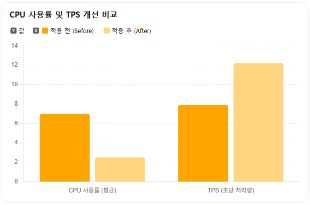

</details>


<details>
<summary><b>🔟 Batch 청크 최적화 성능 개선</b></summary>

| 청크 사이즈 | Step 실행 시간 | 커밋 횟수 | 비고     |
|--------|------------|-------|--------|
| 100    | 8.245초     | 10회   | ✅ 최적   |
| 200    | 9.876초     | 5회    | 20% 느림 |
| 300    | 10.124초    | 4회    | 23% 느림 |

**결론**: 청크 100이 MySQL 트랜잭션 효율 및 전체 처리 속도 모두에서 최적 성능 달성

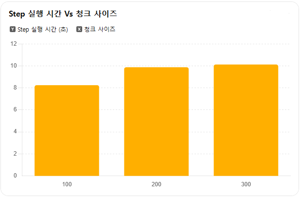

</details>


<details>
<summary><b>1️⃣1️⃣ AWS Lambda SnapStart 적용 전후 비교</b></summary>

### 테스트 환경

| 항목               | 적용 전                             | 적용 후                       |
|------------------|----------------------------------|----------------------------|
| **버전**           | $LATEST (SnapStart 미적용)          | Version 2 (SnapStart 적용)   |
| **측정 시간**        | 2025-11-14 20:35 ~ 21:25 (약 60분) | 2025-11-14 21:39 ~ (약 60분) |
| **실행 횟수**        | 12회 (5분 간격)                      | 12회 (5분 간격)                |
| **메모리 설정**       | 512 MB                           | 512 MB                     |
| **실제 사용 메모리**    | 163 MB                           | 141 MB                     |
| **Runtime**      | Java 21                          | Java 21                    |
| **SnapStart 설정** | off                              | on                         |

### 성능 비교

| 지표            | 적용 전             | 적용 후               | 개선율                     |
|---------------|------------------|--------------------|-------------------------|
| **평균 실행 시간**  | 47.83 ms         | 4.06 ms            | **91.5% 감소 (약 12배 향상)** |
| **최소 실행 시간**  | 19.77 ms         | 3.56 ms            | 82.0% 감소                |
| **최대 실행 시간**  | 75.73 ms         | 4.63 ms            | 93.9% 감소                |
| **평균 과금 시간**  | 49 ms            | 4.5 ms             | **90.8% 절감**            |
| **메모리 사용**    | 163 MB           | 141 MB             | 13.5% 감소                |
| **실행 시간 안정성** | 높은 변동성 (19~75ms) | 매우 안정적 (3.5~4.6ms) | 향상                      |

### 핵심 개선 사항

- **실행 시간 91.5% 감소 (약 12배 향상)**: 47.83ms → 4.06ms
- **비용 90.8% 절감**: 5분마다 실행 시 월간 약 384초의 과금 시간 절감
- **성능 안정성 대폭 향상**: 변동폭 3.8배 → 1.3배로 개선
- **메모리 효율성 13.5% 개선**: 163MB → 141MB

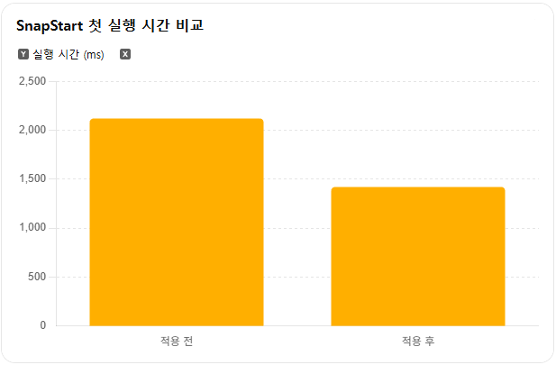

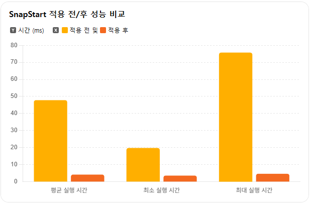

</details>


<details>
<summary><b>1️⃣2️⃣ ECS ARM 아키텍처 적용 전후 비교 (Fargate Graviton2)</b></summary>

### 테스트 환경

| 항목               | 내용                                                |
|------------------|---------------------------------------------------|
| **서비스 종류**       | 실시간 경매 마이크로 서비스 (Spring Boot 기반)                  |
| **ECS 컴퓨팅 유형**   | AWS Fargate (서버리스)                                |
| **Fargate 아키텍처** | **(적용 전)** X86_64 vs **(적용 후)** ARM64 (Graviton2) |
| **Task 정의**      | 1 vCPU, 3 GB Memory                               |
| **테스트 시나리오**     | 1만 건의 동시 경매 입찰 및 낙찰 처리 (부하 테스트)                   |
| **주요 측정 지표**     | P95 API 응답 시간(ms), 시간당 Task 실행 비용($)              |

### 성능 및 비용 비교

| 방식                   | 평균 응답 시간 (P95) | 시간당 실행 비용 | 비용 대비 성능 효율  |
|----------------------|----------------|-----------|--------------|
| **Fargate (X86_64)** | 850ms          | $0.054    | -            |
| **Fargate (ARM64)**  | 680ms          | $0.043    | **약 56% 향상** |

### 핵심 개선 사항

- **평균 응답 시간 20% 단축**: 850ms → 680ms
- **인프라 비용 20% 절감**: vCPU/메모리 요금이 X86 대비 저렴
- **비용 대비 성능 효율 56% 향상**: 더 적은 비용으로 더 빠른 서비스 제공
- **서버리스 환경 최적화**: Graviton 프로세서의 이점을 활용한 컨테이너 실행 효율 극대화

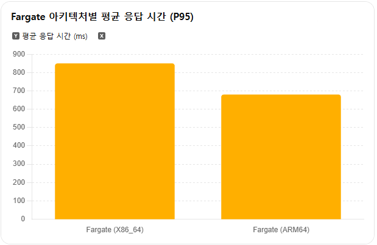

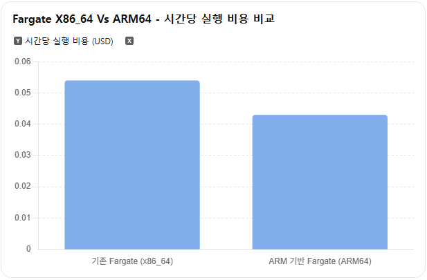

</details>


<details>
<summary><b>1️⃣3️⃣ RDS PROXY 적용 전후 비교</b></summary>

### 테스트 환경

| 항목                | 설정값                                            |
|-------------------|------------------------------------------------|
| **테스트 도구**        | k6 (JavaScript 기반 부하 테스트)                      |
| **테스트 대상 API**    | GET `/auction/api/v1/products/{id}` (상품 상세 조회) |
| **최대 동시 접속자(VU)** | 100명                                           |
| **Ramp-up 시간**    | 1분 (0 → 100명 점진 증가)                            |
| **유지 시간(Hold)**   | 2분 (100명 유지)                                   |
| **읽기 요청 패턴**      | 1~10번 상품 랜덤 조회                                 |

### 성능 비교

| 구분             | 지표                      | Proxy 적용 전 | Proxy 적용 후 | 변화/개선율          |
|----------------|-------------------------|------------|------------|-----------------|
| **API 성능**     | 평균 TPS                  | 68.21      | 71.50      | **+4.8%**       |
|                | P95 응답시간                | 227.90 ms  | 195 ms     | **-14.4%**      |
| **DB 리소스 사용량** | DB Connections (Reader) | 10개        | 5~7개       | **-30% ~ -50%** |
|                | CPU 사용률 (Reader)        | 42%        | 35%        | **-17%**        |

### 핵심 개선 사항

- **P95 응답 시간 14.4% 개선**: 사용자 체감 성능 향상
- **DB Connection 30~50% 감소**: 커넥션 풀 관리 최적화로 시스템 안정성 증가
- **평균 TPS 4.8% 증가**: 커넥션 오버헤드 감소로 처리량 향상
- **CPU 사용률 17% 감소**: DB 부하 감소로 인프라 효율성 개선
- **단순한 설정만으로 안정성, 확장성, 비용 효율성 동시 달성**

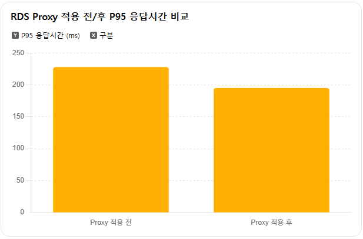

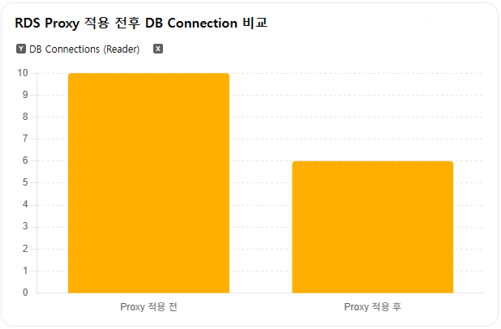

</details>


<details>
<summary><b>1️⃣4️⃣ CloudFront 적용 전후 비교</b></summary>

### 테스트 환경

| 항목                      | 설정값               |
|-------------------------|-------------------|
| **OS**                  | Windows 11        |
| **Test Tool**           | Postman           |
| **Request Method**      | GET               |
| **Request Count**       | 20                |
| **CloudFront 적용 전 URL** | S3 Pre-signed URL |
| **CloudFront 적용 후 URL** | CloudFront 도메인    |

### 성능 비교

| 구분                    | 최초 응답 시간 | 평균 응답 시간 | 개선율          |
|-----------------------|----------|----------|--------------|
| **적용 전 (S3)**         | 1,216ms  | 1,232ms  | -            |
| **적용 후 (CloudFront)** | 60ms     | 27ms     | **약 45배 개선** |

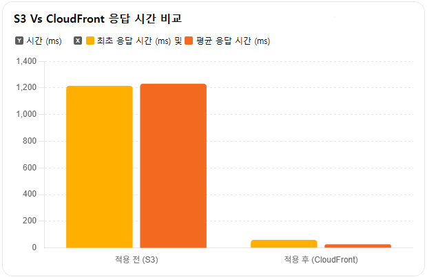

### 핵심 개선 사항

- **응답 시간 약 45배 개선**: 평균 1,232ms → 27ms로 지연 시간 최소화
- **비용 효율성 향상**: 트래픽이 많을수록 CloudFront 자체 요금이 S3 데이터 전송 요금 대비 효율적
- **안정성 향상**: 원본 데이터 장애 시에도 캐시된 콘텐츠 제공 가능
- **높은 가용성 보장**: 글로벌 CDN으로 전 세계 어디서나 빠른 응답
- **보안 강화**: OAC(Origin Access Control)로 CloudFront에서만 S3 접근 가능

### 결론

> **응답 속도**에 큰 개선이 일어났을 뿐만 아니라 **비용, 보안, 안정성**까지 챙길 수 있는 것으로 확인되었다.
>
> 실서비스 기준으로 적용할 가치가 매우 높은 것으로 확인되었다.

</details>

---

## 💡 기술적 의사결정

<details>
<summary><b>1️⃣ 부하 테스트 도구: k6 선택</b></summary>

### 문제 인식

- 실제 트래픽 시뮬레이션 기반의 성능 측정 필요
- 기존 Grafana + Prometheus 모니터링 스택과의 통합 필요

### 고려한 접근 방식

| 도구         | 장점                               | 단점                |
|------------|----------------------------------|-------------------|
| **JMeter** | 기능 다양                            | 무겁고 GUI 중심, 협업 불편 |
| **k6** ✅   | Prometheus/Grafana 통합 용이, 가볍고 빠름 | JS 러닝 커브 존재       |

### 핵심 포인트

- 팀 환경(Grafana, Prometheus)에 가장 자연스럽게 통합 가능
- 로컬 환경에서도 안정적으로 부하 테스트 가능
- 코드 기반 테스트로 일관성·협업성 강화

</details>

<details>
<summary><b>2️⃣ MSA 아키텍처 도입</b></summary>

### 최종 결정

- 기능 추가 시 복잡도 급증, 유지보수 비용 폭증
- 특정 기능의 부하가 전체 서비스 확장 강제
- 배포 주기가 길어지고 시장 대응 속도 저하

### 비교 분석

| 구분         | Monolithic   | Modular Monolith | **MSA (채택)**        |
|------------|--------------|------------------|---------------------|
| **독립성**    | ❌ 강한 결합      | 논리적 분리           | ✅ 완벽한 물리적 분리        |
| **확장성**    | ❌ 전체 확장만 가능  | ❌ 전체 확장만 가능      | ✅ 서비스별 개별 확장        |
| **장애 격리**  | ❌ 장애가 전체로 전파 | ❌ 장애가 전체로 전파     | ✅ 장애를 서비스 단위로 국지화   |
| **개발/배포**  | ❌ 느리고 위험함    | 개발은 분리, 배포는 통합   | ✅ 팀별 자율적이고 빠른 개발/배포 |
| **운영 복잡성** | ✅ 단순         | ✅ 단순             | ❌ 관리 포인트 급증         |

### 최종 결정

압도적인 민첩성과 확장성을 위해 MSA를 최종 채택하여 장기적인 성장 기반 마련
</details>

<details>
<summary><b>3️⃣ 서비스 간 통신: OpenFeign 선택</b></summary>

### 문제 인식

- 서비스별 DB 분리로 인한 통신 필요
- 효율성·생산성·성능을 모두 고려한 기술 선택 필요

### 비교 분석

| 방식              | 장점                   | 단점                  |
|-----------------|----------------------|---------------------|
| **OpenFeign** ✅ | Spring 친화적, 러닝 커브 낮음 | JSON 직렬화로 인한 지연 발생  |
| **gRPC**        | 초저지연, 다언어 지원         | proto 관리, 인프라 설정 복잡 |

### 최종 결정

Spring 기반 통합성과 생산성을 고려해 OpenFeign을 채택
</details>

<details>
<summary><b>4️⃣ Redis 도입</b></summary>

### 문제 인식

- 실시간 입찰 처리 시 RDBMS 병목 발생
- 빈번한 데이터 업데이트로 DB 부하 증가
- 분산 환경 동시성 제어 필요

### 비교 분석

| 구분             | RDBMS   | In-Memory Cache | **Redis (채택)**             |
|----------------|---------|-----------------|----------------------------|
| **실시간 데이터 처리** | 성능 저하   | 불가 (공유 불가)      | ✅ Atomic 명령어로 원자적 처리       |
| **분산 락**       | 비효율적    | 불가              | ✅ SETNX 기반의 효율적 분산 락       |
| **캐싱**         | 제한적     | 매우 빠름           | ✅ 모든 인스턴스가 공유하는 고성능 캐시     |
| **다양한 자료구조**   | 스키마에 종속 | 단순 Key-Value    | ✅ Sorted Set 등 다양한 자료구조 지원 |

### 최종 결정

압도적인 성능, 원자적 연산, 다양한 활용성을 고려하여 Redis 도입
</details>

<details>
<summary><b>5️⃣ Elasticsearch 도입</b></summary>

### 문제 인식

- 복합 조건 검색 시 RDBMS `LIKE` 검색의 성능 한계
- 부정확한 한국어 검색 (형태소 분석 부재)
- 실시간 데이터 반영 시 DB 부하 증가

### 비교 분석

| 구분             | RDBMS               | **Elasticsearch (채택)** |
|----------------|---------------------|------------------------|
| **복합/전문 검색**   | ❌ LIKE 검색 의존, 성능 한계 | ✅ 역 인덱스 기반의 빠른 전문 검색   |
| **한국어 형태소 분석** | ❌ 기본 기능 부재          | ✅ nori 플러그인을 통한 완벽 지원  |
| **실시간 데이터 반영** | ❌ DB 직접 변경으로 부하 가중  | ✅ 배치 처리를 통한 부하 분산      |
| **수평적 확장성**    | ❌ 매우 복잡하고 비용 부담 큼   | ✅ 샤드 기반의 유연한 수평 확장     |

### 최종 결정

빠르고 정확한 검색 경험 제공을 위해 Elasticsearch 도입
</details>

<details>
<summary><b>6️⃣ RabbitMQ 비동기 이벤트 도입</b></summary>

### 문제 인식

- 동기 API로 인한 서비스 간 의존성 증가
- 특정 서비스 장애가 전체 시스템으로 전파될 위험
- 모든 후속 처리 완료 시까지 사용자 대기

### 비교 분석

| 구분          | 동기 API 호출       | DB 폴링     | **RabbitMQ (채택)**    |
|-------------|-----------------|-----------|----------------------|
| **서비스 결합도** | ❌ 높음            | 보통        | ✅ 느슨한 결합             |
| **성능/응답성**  | ❌ 사용자 대기 시간 김   | ❌ 실시간성 부족 | ✅ 즉각적인 응답            |
| **탄력성/신뢰성** | ❌ 장애 전파, 데이터 유실 | 보통        | ✅ 브로커를 통한 재시도/DLQ 처리 |

### 최종 결정

느슨한 결합을 통한 MSA 아키텍처 완성 및 비동기 처리를 통한 사용자 경험 극대화
</details>

<details>
<summary><b>7️⃣ 일괄 처리 과정을 AWS Lambda 전환</b></summary>

### 문제 인식

- EC2 서버가 작업이 없을 때도 24시간 운영되어 불필요한 비용 발생
- 특정 시간대 부하 급증 시 즉각적인 스케일 아웃 어려움
- 배치 작업이 메인 DB에 직접 부하 유발

### 비교 분석

| 구분         | Spring Batch on EC2 | **EventBridge + Lambda (채택)** |
|------------|---------------------|-------------------------------|
| **실시간 처리** | 스케줄 기반 (지연)         | ✅ 이벤트 기반 (거의 실시간)             |
| **인프라 운영** | 서버 관리/모니터링 부담       | ✅ 서버리스 (운영 부담 제로)             |
| **확장성**    | 수동/복잡한 설정           | ✅ 자동 및 즉시 확장                  |
| **비용**     | 고정 비용 (유휴 시간 포함)    | ✅ 사용한 만큼만 지불                  |

### 최종 결정

비용, 확장성, 운영 효율을 모두 극대화하는 서버리스 선택
</details>

<details>
<summary><b>8️⃣ Blue-Green 배포 도입</b></summary>

### 문제 인식

- 서비스 무중단 배포 필수
- 배포 안정성 및 검증 필요
- 신속한 롤백 요구

### 비교 분석

| 구분            | Recreate     | Rolling Update | **Blue Green (채택)**   |
|---------------|--------------|----------------|-----------------------|
| **서비스 무중단**   | ❌ 필수 다운타임 발생 | 부분 가용          | ✅ Zero-Downtime 완벽 보장 |
| **사전 검증 범위**  | 제한적          | 제한적            | ✅ 완벽히 분리된 전체 환경 검증    |
| **치명적 롤백 속도** | ❌ 전체 재배포로 지연 | 역방향 롤아웃으로 지연   | ✅ 로드밸런서 스위칭 (즉시 복구)   |
| **자원 효율성**    | ✅ 매우 높음      | ✅ 높음           | ❌ 운영 자원 2배 필요         |

### 최종 결정

Zero-Downtime 배포, 완벽한 환경 검증, 즉각적인 복구 능력 제공
</details>

---

## 🚨 트러블 슈팅

<details>
<summary><b>1️⃣ Spring Rest Docs 경로 오류 해결 (Windows 환경)</b></summary>

### 문제 상황

Windows 11 환경에서만 AsciiDoc 문서 생성 실패

### 원인 분석

Windows 경로 처리 방식과 Gradle 플러그인 간의 비일관성

- 경로 중복 결합: `C:/.../snippets/C:/.../auto-index.adoc`

### 해결 방법

WSL 환경에서 빌드 실행

```bash
wsl
cd /mnt/c/Users/YourName/project
./gradlew clean build
```

### 배운 점

- 환경 의존적 버그는 코드 수정으로 해결되지 않을 수 있음
- 크로스 플랫폼 도구 사용 시 경로 정규화 문제 주의

</details>

<details>
<summary><b>2️⃣ Docker OpenJDK 이미지 지원 종료 해결</b></summary>

### 문제 상황

```
openjdk:21-jdk-slim: not found
```

### 원인 분석

`openjdk:21-jdk-slim` 베이스 이미지가 Deprecated됨

### 해결 방법

Eclipse Temurin으로 교체

```dockerfile
# 수정 전
FROM openjdk:21-jdk-slim

# 수정 후
FROM eclipse-temurin:21-jdk
```

### 배운 점

- 공식 이미지라도 언제든 지원 종료 가능
- 외부 의존성 정기 모니터링 필요

</details>

<details>
<summary><b>3️⃣ RabbitMQ 무한 로그 출력 오류 해결</b></summary>

### 문제 상황

입찰 요청 시 로그가 무한히 출력

### 원인 분석

1. RabbitMQ 이벤트 매핑 오류

```java
// 잘못된 매핑
EVENT_TYPE_MAPPINGS.put("auction.BidPlacedEvent",AuctionEndedEvent .class);
```

2. 트랜잭션 롤백 → 재발행 루프

### 해결 방법

```java
// 올바른 매핑
EVENT_TYPE_MAPPINGS.put("auction.BidPlacedEvent",BidPlacedEvent .class);

// 에러 핸들링 강화
try{

handleEvent(event);
}catch(
Exception e){
	log.

error("처리 실패 - eventId={}, error={}",event.getId(),e.

getMessage());
	}
```

### 배운 점

- 이벤트 타입 검증 로직 필요
- DLQ 모니터링 체계 구축 필요

</details>

<details>
<summary><b>4️⃣ 트랜잭션 전파로 인한 락 무효화 오류 해결</b></summary>

### 문제 상황

분산 락을 사용했음에도 동시 입찰이 제대로 제어되지 않음

### 원인 분석

클래스 단위 `@Transactional(readOnly=true)`로 인해 내부 메서드의 트랜잭션이 분리되지 않음

### 해결 방법

```java

@Transactional(propagation = Propagation.REQUIRES_NEW)
public BiddingResultDto process(AuctionBidRequest request, long auctionId, long memberId) {
	// Critical Section - 새로운 트랜잭션으로 처리
}
```

### 배운 점

- 분산 락의 범위 ≥ 트랜잭션의 범위
- 락 내부 로직은 독립된 트랜잭션으로 처리 필요

</details>

<details>
<summary><b>5️⃣ Redis 캐시 역직렬화 문제 해결</b></summary>

### 문제 상황

Redis에서 데이터를 꺼낼 때 타입 정보를 잃어 역직렬화 실패

### 원인 분석

ObjectMapper 커스터마이징 시 `activateDefaultTyping()` 설정 누락

### 해결 방법

Serializer를 두 개로 분리

```java
// 단일 객체용
ObjectMapper objectMapperForSingle = new ObjectMapper();
objectMapperForSingle.

activateDefaultTyping(...);

Jackson2JsonRedisSerializer<Object> singleObjectSerializer = ...

// 리스트/컬렉션용
GenericJackson2JsonRedisSerializer genericSerializer = ...
```

### 배운 점

- ObjectMapper 커스터마이징 시 타입 정보 포함 설정 필수
- 리스트/객체는 Serializer 분리가 안정적

</details>

<details>
<summary><b>6️⃣ Master/Slave 환경의 중첩 트랜잭션 readOnly 라우팅 문제</b></summary>

### 문제 상황

쓰기 트랜잭션 내부에서 `readOnly=true` 메서드 호출 시 SLAVE로 라우팅되어 오류 발생

### 원인 분석

데이터소스 라우팅 로직이 애노테이션만 확인하고 실제 트랜잭션 상태를 무시

### 해결 방법

```java
boolean actualReadOnly = TransactionSynchronizationManager.isActualTransactionActive()
	? TransactionSynchronizationManager.isCurrentTransactionReadOnly()
	: transactional.readOnly();

dataSourceType =actualReadOnly ?DataSourceType.SLAVE :DataSourceType.MASTER;
```

### 배운 점

- 항상 `TransactionSynchronizationManager`로 실제 트랜잭션 상태 확인 필요
- 중첩 트랜잭션 시 외부 트랜잭션 성격 보존 중요

</details>

<details>
<summary><b>7️⃣ Spring Batch DataSource 인식 문제 해결</b></summary>

### 문제 상황

Spring Batch 메타데이터가 비즈니스 DB와 동일한 DataSource에 저장되어 관리 복잡도 증가

### 원인 분석

`JobRepository`가 기본 DataSource를 사용

### 해결 방법

`DefaultBatchConfiguration` 상속 및 `getDataSource()` 오버라이드

```java

@Configuration
public class BatchConfig extends DefaultBatchConfiguration {

	@Override
	protected DataSource getDataSource() {

		return batchDataSource; // 메타데이터 전용 DB
	}

}
```

### 배운 점

- 메타데이터와 비즈니스 데이터의 명확한 분리로 성능과 관리성 확보

</details>

<details>
<summary><b>8️⃣ Ranking Lambda 마이그레이션 문제 해결</b></summary>

### 문제 상황

Lambda → HTTP → Main Service 구조로 마이그레이션 시도했으나 다양한 경로에서 요청 실패

### 원인 분석

1. Service Discovery DNS는 ECS Task 내부 전용
2. ALB 보안 그룹이 Lambda SG 허용 안 함
3. ECS Task Private IP는 재시작 시 변경됨

### 해결 방법

Direct DB Access Pattern으로 전환

```
변경 전: EventBridge → Lambda → HTTP → Main Service → DB
변경 후: EventBridge → Lambda → DB 직접 접근
```

### 장점

- 네트워크 문제 즉시 해소
- 레이턴시 감소
- 구조 단순화

### 배운 점

Lambda에서 ECS Service로 HTTP 호출은 AWS 네트워크 구조와 맞지 않음
DB 직접 접근이 가장 단순하고 안정적
</details>

<details>
<summary><b>9️⃣ Lambda 입찰가 동기화 중복 업데이트 버그</b></summary>

### 문제 상황

Lambda가 1분마다 `auction:*:current-bid-price` 키를 조회하여 입찰이 없어도 매번 OpenSearch를 업데이트하는 중복 처리 발생

### 원인 분석

```java
// 기존: 모든 입찰가 키를 조회
Set<String> keys = jedis.keys("auction:*:current-bid-price");
// 문제: 실제 입찰 발생 여부를 판단할 수 없음
```

- 입찰가 키가 존재하면 실제 입찰 발생 여부와 관계없이 조회됨
- OpenSearch 값 비교 로직도 API 호출 오버헤드 및 타이밍 이슈 발생

### 해결 방법

**동기화 플래그 기반 이벤트 드리븐 방식으로 전환**

```java
// Application: 입찰 성공 시 플래그 생성
public void createOpenSearchSyncFlag(long auctionId, long bidPrice) {

	stringRedisTemplate.opsForValue()
		.set("opensearch:sync:" + auctionId, String.valueOf(bidPrice));
}

// Lambda: 플래그 기반 처리
Set<String> keys = jedis.keys("opensearch:sync:*");  // 플래그만 조회
// 플래그 값 읽기 → OpenSearch 업데이트 → 플래그 삭제
```

**동작 흐름**

```
입찰 발생 → opensearch:sync:123 플래그 생성
   ↓
Lambda 실행 (1분 후)
   ↓
플래그 조회 → OpenSearch 업데이트 → 플래그 삭제
```

### 배운 점

- **이벤트 기반 설계**: 변경 발생 시에만 플래그 생성 → 필요한 것만 처리
- **명확한 의도 표현**: `opensearch:sync:*` 키 네이밍으로 동기화 필요 여부 명시
- **단순함의 가치**: 비교 로직 제거로 성능 향상 및 버그 가능성 최소화

</details>

---

## 👥 팀원 소개

<div align="center">

### UPPICK Team

</div>

<table>
<tr>
<td align="center" width="20%">
<a href="https://github.com/VBKOROA">

<br/><b>👑 유영관</b><br/>
<sub>팀장</sub>
</a>
</td>
<td align="center" width="20%">
<a href="https://github.com/sooh59599">

<br/><b>🎯 박수현</b><br/>
<sub>부팀장</sub>
</a>
</td>
<td align="center" width="20%">
<a href="https://github.com/kimseokjun">

<br/><b>💻 김석준</b><br/>
<sub>팀원</sub>
</a>
</td>
<td align="center" width="20%">
<a href="https://github.com/DoH100">

<br/><b>⚡ 백도현</b><br/>
<sub>팀원</sub>
</a>
</td>
<td align="center" width="20%">
<a href="https://github.com/TwoTechSide">

<br/><b>🚀 정직한</b><br/>
<sub>팀원</sub>
</a>
</td>
</tr>
</table>

<br/>

---

<div align="center">

## 감사합니다 ❤️

**Up-Pick 프로젝트에 관심을 가져주셔서 감사합니다!**

<br/>


</div>


